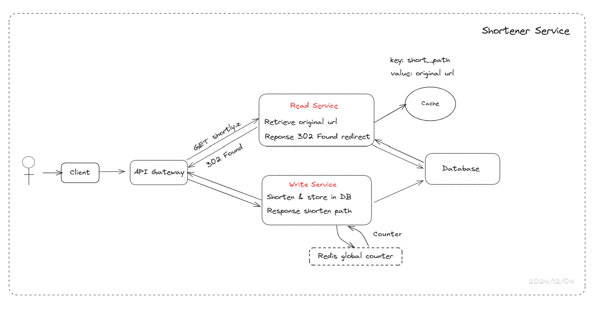

URL Shortener

# Deep Dive

Focus on the most **challenging and interesting parts** of the system, ensuring our design meets all non-functional requirements, **addressing edge cases**, bottlenecks, and failure points.

Example:

- Scale up to 100M DAUs. Lead the discussion on how to scale the system to support 100M DAUs. Discuss around horizontal scaling, caching, load balancing, etc. Update the design to support this scale.
- Ensure the latency of the system is less than 100ms. Discuss how to reduce latency, such as using a CDN, caching, etc. Our system is focus on write-heavy, or read-heavy, or both. Discuss how to optimize the system for the specific use case.

Have a deep dive into the system and design the components in detail, challenges, and solutions.
Hope you able to identify this places yourself and lead the discussion.

## Ensure shorterned urls are unique and short

Solutions:

1. Use a **hash function** to generate a **unique hash for the given URL**. The hash function should be fast and generate unique hashes for different URLs.

Use some randomness to try to ensure that the generated hash is unique. This can be done by adding a random number to the URL before hashing it.
Lead the discussion on how to generate a unique hash for the given URL. Discuss the pros and cons of using randomness and hash function to generate a unique hash.

The simplest way is using Math.random() to generate a random number and append it to the URL before hashing it. The cons of this approach are that it is not guaranteed to generate unique hashes and it can be predictable.

Using hash function to generate a fixed length hash. The hash function should generate a fixed length hash for the given URL. The hash function should be fast and generate unique hashes for different URLs.

Either using randomness or hash function, the generated hash would become input to base62 encoding and then cut to a fixed length.

**Problem**: The generated hash may not be unique. If two different URLs generate the same hash, the system will not be able to distinguish between them.
Increase the length of the hash to reduce the chance of collision. The longer the hash, the lower the chance of collision.
But the longer the hash, the longer the shortened URL. The goal is to generate a short URL, so we need to balance the length of the hash and the length of the shortened URL.

2. Use a counter to generate a unique id and convert the id to a short string. The counter can be incremented for each new URL.

[https://redis.io/glossary/storing-counters-in-redis/](https://redis.io/glossary/storing-counters-in-redis/)

Advantages: The counter ensures that the generated id is unique. The counter can be stored in a distributed cache to ensure that it is updated atomically. We can horizontally scale the the system with proper counter management.

Challenge: In distributed systems, maintaining a global counter can be challenging. The counter needs to be updated atomically to ensure that it is unique.

3. Use a combination of the above two methods. Generate a unique id and convert it to a short string using a hash function.

The global counter can be used to generate a unique id and the hash function can be used to convert the id to a short string. The hash function should generate a fixed length hash for the given id.

Cons: Redis scalability issue for global counter.
The counter can be stored in a distributed cache to ensure that it is updated atomically.
We can horizontally scale the the system with proper counter management.

## Handle redirection latency

Solutions:

- Using Indexing to avoid scanning the entire database. We can use indexing to avoid scanning the entire database to find the original URL for a given short URL. We can create an index on the short URL column to quickly find the original URL.

>> Advantages: Performance improvement. The database can quickly find the original URL for a given short URL.
>> Challenge: For 100M DAUs, we have more than 5000 requests per second. The database needs to handle the load of 5000 requests per second. High load can cause latency in redirection.

- Use a distributed cache to store the short URLs and redirect requests to the original URLs. This will reduce the latency of redirection.

>> Suggest: Redis, Memcached, etc.
Lie between the application and the database. The cache can store the short URLs and redirect requests to the original URLs. The cache can be distributed across multiple servers to handle the load of 5000 requests per second.
>> Challenge: Cache invalidation. The cache needs to be updated when a new short URL is created or an existing short URL is updated.

- Use a CDN to cache the short URLs and redirect requests to the original URLs. This will reduce the latency of redirection.

>> Suggest: CloudFront, Akamai, Cloudflare, etc.

- Use a load balancer to distribute the requests to multiple servers. This will reduce the load on the servers and improve the latency of redirection.

## Handle 100M DAUs and 1B URLs

Solutions:

### Database

- Calculate size of each record.
Calculation: short code (6 bytes) + original URL (200 bytes) + timestamp (8 bytes) + user id (4 bytes) + custom alias (100 bytes) = 318 bytes. Round up to 500 for additional metadata and analytics.

For 1B URLs, the total size of the database would be 500 GB. We can use sharding to distribute the data across multiple servers.

- What database should we use?

Any database would work here. We offload the heavy-read traffic to the cache, so the database is not the bottleneck. We can use a SQL database like MySQL or a NoSQL database like Cassandra.

Availability: We can use a master-slave replication to ensure high availability.

### Server

Because the system is read-heavy, we can use a api gateway to distribute the requests to multiple services (read & write). This helps maintain and scale the system, especially the read service.
