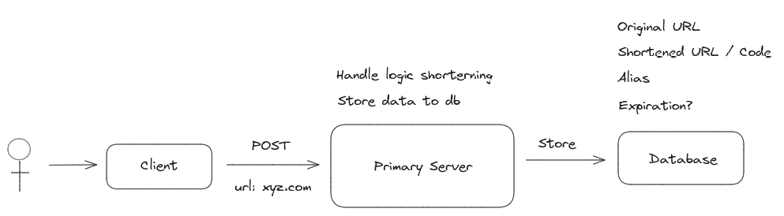
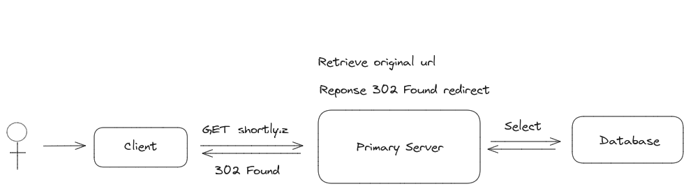

URL Shortener

# High Level Design

Go through the requirements and design the high level architecture one by one.
Drawing boxes representing components and lines representing interactions between components.
Be explicit about data flow through the system, and how components will interact with each other, how each component will respond to changes from each request.

## Users should be able to shorten a URL

1. **Client**: The client sends a POST request to the server to shorten a URL.
2. **Server**: The server receives the request, validates the URL if it is valid url and not already shortened, and generates a shortened URL.
3. **Database**: The server stores the original URL and shortened URL in the database.

## Users should be able to visit a shortened URL and get redirected to the original URL

1. **Client**: The client sends a GET request to the server with the shortened URL.
2. **Server**: The server receives the request, fetches the original URL from the database, and redirects the client to the original URL. And validates the shortened URL if it is valid and not expired.
3. **Server**: Reponse with a 302 status code and the original URL in the Location header. It's not 301 because the shortened URL is not a permanent redirect. If status code 301 is used, the client will cache the redirection and will not hit the server again.
