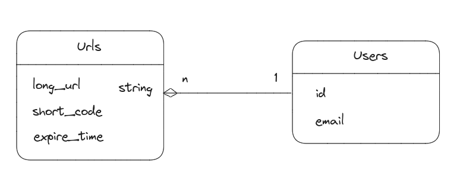

URL Shortener

# Low Level Design

Translate the high level design into a detailed technical design that is ready for implementation. Focus on the data structures, algorithms, and patterns that will be used to solve the problem.

## Object oriented design

